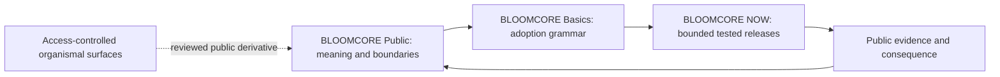

<!-- SPDX-License-Identifier: Apache-2.0 -->

# BLOOMCORE repository constellation

This is the canonical public navigation map for the BLOOMCORE GitHub repositories. It describes differentiated publication roles, not a command hierarchy or proof of organism-wide integration.

## Public repositories

| Repository | Begin here | Bounded role |
|---|---|---|
| **BLOOMCORE Public** | [`README.md`](../../README.md) | Canonical public explanation, Phase 38 orientation, FAQ, licensing, and evidence boundaries |
| **BLOOMCORE Basics** | [GitHub](https://github.com/dkl101001/BLOOMCORE-Basics) | Adoption-facing schemas, examples, validators, and public technical grammar |
| **BLOOMCORE NOW** | [GitHub](https://github.com/dkl101001/BLOOMCORE-NOW) | Bounded tested releases, foundry workflow, and release evidence |

Arrows show intended documentation and release flow. They do not grant authority, prove runtime coupling, or make one repository the organism.

## Access-controlled surfaces

Private organismal repositories may hold custody, identity-continuity, integration, or release-preparation material. They are not linked from this public map. Access, source presence, test presence, or private documentation does not establish complete implementation or authorize disclosure.

## Shared design contract

Every repository should state:

1. its role;
2. where a reader begins;
3. what belongs and does not belong there;
4. the strength of its evidence;
5. its applicable license or proprietary-rights boundary; and
6. how it relates to the wider constellation without claiming to be the whole.
